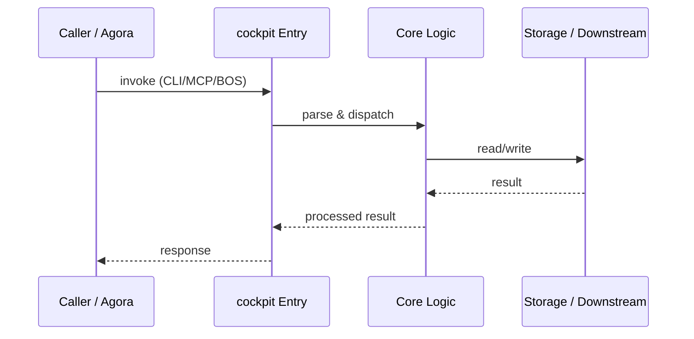

# cockpit — Call Chain

> 本文档描述 cockpit 内部最核心的一条调用链 / 数据流。
>
> 通用跨层调用链参见：[`../../docs/I0-AGORA-CALLCHAIN.md`](../../docs/I0-AGORA-CALLCHAIN.md)

---

## 关键路径

1. 1. Human runs `cockpit research search "query"` (CLI) or calls MCP `workspace_context`
2. 2. CLI dispatcher (`cli.py`) routes to command handler (`commands/research.py`)
3. 3. For cross-layer calls, cockpit constructs `bos://` URI and delegates to agora :7431
4. 4. Agora routes to downstream service (e.g. `bos://memory/kos/search`)
5. 5. Result flows back through agora → cockpit → human, or via MCP response
6. 6. `cards --check` path: cli.py → governance → l4bridge.py → l4-kernel

## Sequence Diagram

